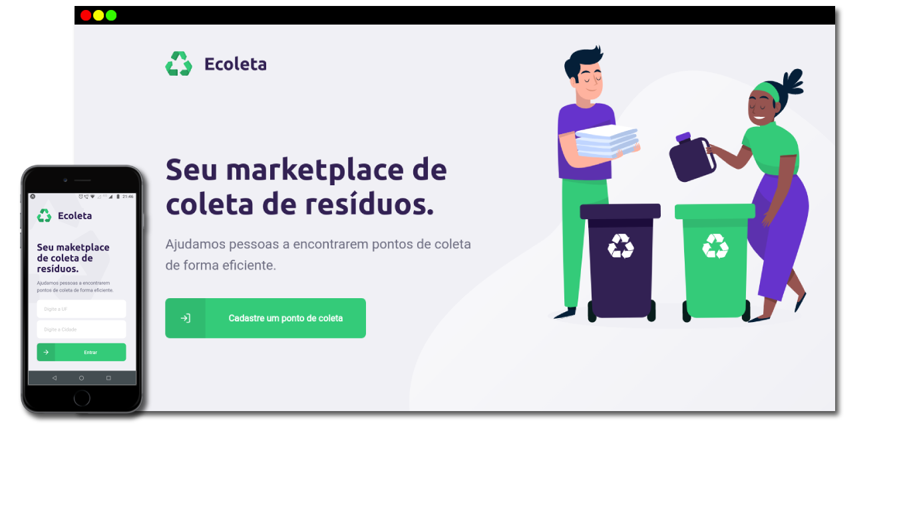

<h1 align="center" style="border-bottom: 1px solid #eee; margin: 20px 0; padding-bottom: 10px;">
<br><br/>
<p>Recicle! ajude o meio ambiente!</p>
</h1>


<p align="center" >
  <a href="#fire-prévia-da-aplicação"> :fire: Prévia da Aplicação</a> |
  <a href="#rocket-tecnologias-utilizadas"> :rocket: Tecnologias Utilizadas</a> |
  <a href="#zap-executando-o-projeto"> :zap: Executando o Projeto </a> |
</p>

## :bookmark_tabs: Sobre o Projeto

O ***Ecoleta*** é uma aplicação Web e Mobile para ajudar pessoas a encontrarem pontos de coleta para reciclagem.

Essa aplicação foi construída na trilha ***Booster*** da ***Next Level Week*** distribuída pela [Rocketseat](https://rocketseat.com.br/). A ideia de criar uma aplicação voltada ao meio ambiente surgiu da coincidência da data do curso e a data da semana do meio ambiente

## :fire: Prévia da Aplicação

<div align="center">


</div>

## :rocket: Tecnologias Utilizadas

- [TypeScript](https://www.typescriptlang.org/)
- [NodeJS](https://nodejs.org/en/)
- [ReactJS](https://pt-br.reactjs.org/)
- [ReactNative](https://reactnative.dev/)
- [ExpressJS](https://expressjs.com/pt-br/)
- [Knex](http://knexjs.org/)
- [Axios](https://github.com/axios/axios)


## :heavy_check_mark: :computer: Resultado Web

<h1 align="center">
    
</h1>

## :heavy_check_mark: :iphone: Resultado Mobile

<h1 align="center">
    
    
</h1>

<a id="como-usar"></a>

## :fire: Como usar

- ### **Pré-requisitos**

  - É **necessário** possuir o **[Node.js](https://nodejs.org/en/)** instalado na máquina
  - Também, é **preciso** ter um gerenciador de pacotes seja o **[NPM](https://www.npmjs.com/)** ou **[Yarn](https://yarnpkg.com/)**.
  - Por fim, é **essencial** ter o **[Expo](https://expo.io/)** instalado de forma global na máquina

1. Faça um clone :

```sh
  $ git clone https://github.com/alancsoliveira/rocketseat-NLWBooster-Ecoleta.git
```

2. Executando a Aplicação:

```sh
  # Instale as dependências
  $ npm install

  ## Crie o banco de dados
  $ cd server
  $ npm run knex:migrate
  $ npm run knex:seed

  # Inicie a API
  $ npm run dev

  # Inicie a aplicação web
  $ cd web
  $ npm start

  # Inicie a aplicação mobile
  $ cd mobile
  $ npm start
```


## :memo: Licença

Este projeto foi desenvolvido sob a licença MIT. Veja o arquivo [LICENSE](LICENSE) para saber mais detalhes.


<p align="center" style="margin-top: 20px;">Made with :purple_heart: by <strong> Alan C S Oliveira </p>
